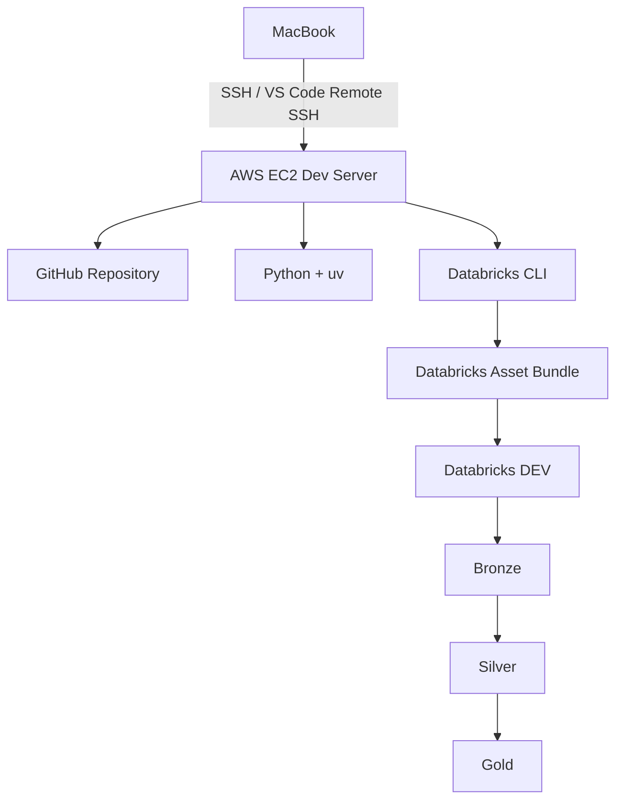

# Phase 1 — EC2 + SSH Remote Development Setup

## Project Name
Data Engineering DevOps Stack

## Project Summary
This project is a practical Data Engineering and DevOps learning project designed to build a secure remote development workflow on AWS EC2, connect it with GitHub and Databricks, and document every issue, fix, and lesson in a structured way.

## Project Description
The goal of this phase is to create a remote Linux environment on EC2 and connect to it safely from a MacBook using SSH and VS Code Remote SSH. This becomes the foundation for all later phases, including Python setup, Git workflow, Databricks integration, deployment automation, and CI/CD.

## Tools / Technologies
- AWS EC2
- Ubuntu 24.04
- AWS Security Groups
- SSH
- ED25519 SSH keys
- VS Code
- VS Code Remote - SSH
- macOS Terminal
- GitHub

## Phase Goal
Create a secure and stable remote Linux development environment on AWS EC2 and connect to it from a local machine using SSH and VS Code Remote SSH.

## Step 1: Launch EC2 instance
- Create an Ubuntu EC2 instance in AWS.
- Select the appropriate instance size and storage.
- Review networking and security settings before launch.

## Step 2: Configure security group
- Allow inbound SSH on port 22.
- Validate the source IP or use a learning-friendly access rule.
- Confirm that the instance is reachable from the local machine.

## Step 3: Connect using SSH and VS Code
- Connect with the `.pem` key or a generated personal SSH key.
- Add a clean alias in `~/.ssh/config`.
- Verify SSH connectivity and configure Remote SSH in VS Code.

## Issues faced
1. SSH connection timed out.
2. EC2 public IP changed after stop/start.
3. Duplicate SSH host entries caused confusion.
4. VS Code Remote SSH disconnected intermittently.
5. Authentication setup was initially unclear.

## Root cause
- The EC2 Security Group allowed SSH only from an older laptop public IP.
- The EC2 instance was restarted and received a new public IPv4.
- Multiple SSH entries pointed to stale or conflicting values.
- Remote session reliability needed keepalive tuning and a stronger instance size.
- The project initially used AWS-generated keys without a clear long-term personal SSH strategy.

## Fix
- Update the Security Group to allow SSH access in the working environment.
- Remove duplicate SSH configuration and keep one clean host alias.
- Update the host details in `~/.ssh/config` to use the current EC2 public IP.
- Add SSH keepalive settings to reduce disconnects.
- Upgrade the EC2 instance when needed for better remote development stability.
- Generate and use a personal ED25519 key pair for secure access.

## What I learned
- A laptop public IP can change, so SSH rules must match the current environment.
- EC2 public IPv4 addresses may change after stop/start.
- SSH configuration should be simple, centralized, and clean.
- Multiple host aliases create confusion and broken access patterns.
- VS Code Remote SSH is highly effective for cloud-based development.
- SSH keepalive settings help maintain stable remote sessions.
- Private SSH keys should stay on the local machine and never be shared.

## Interview questions
1. Why did the SSH connection fail even though the EC2 instance was running?
2. What is the purpose of an AWS Security Group?
3. Why does an EC2 public IPv4 sometimes change?
4. What is the difference between a private SSH key and a public SSH key?
5. Why is VS Code Remote SSH useful for cloud-based development?
6. How can SSH be made more stable in remote development workflows?

## Architecture overview

## Phase status ✅
Completed: EC2 instance is running, SSH access is working, and VS Code Remote SSH is successfully connected to the remote development environment.
