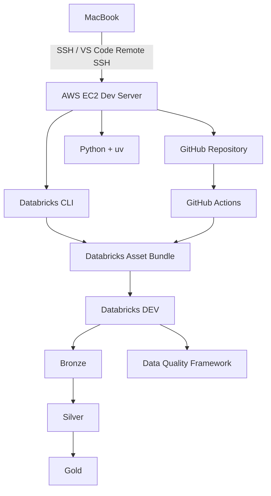

# Project Name

Data Engineering DevOps Stack

# Summary

This project is a lightweight data engineering and DevOps setup designed to demonstrate a modern workflow using VS Code, GitHub, EC2, Databricks, and CI/CD automation. The goal is to build a repeatable environment for data pipelines, infrastructure automation, and deployment practices while keeping the stack simple, scalable, and easy to manage.

# Description

The repository acts as a central project tracker and implementation reference for the data engineering and DevOps workflow. It combines local development in VS Code with remote deployment and integration patterns that include cloud compute, source control, and data platform tooling. The project focuses on practical engineering activities such as environment setup, source versioning, automated delivery, pipeline orchestration, and operational learning.

The technical direction includes:

- Local development and project tracking in VS Code
- GitHub-based source control and collaboration
- EC2 as the compute environment
- Databricks for data processing, notebooks, and asset bundles
- CI/CD pipelines for deployment automation
- Documentation and operational visibility through project tracking

# Tools / Technologies

- VS Code
- Git and GitHub
- Amazon EC2
- Databricks
- Python
- Bash / Shell scripting
- YAML for CI/CD configuration
- Markdown for documentation
- Infrastructure as code concepts
- GitHub Actions or similar automation tooling

# Phase Tracker

| Phase | Name | Status | Owner | Notes |
| --- | --- | --- | --- | --- |
| 1 | EC2 + SSH Remote Development Setup | Completed | DevOps / Engineering | EC2 instance configured, SSH working, VS Code Remote SSH connected |
| 2 | Environment provisioning | In Progress | DevOps Engineer | EC2 and supporting environment setup |
| 3 | GitHub integration | Planned | Engineering Team | Repository sync and access validation |
| 4 | Databricks integration | Planned | Data Engineer | Asset bundle and workflow connection |
| 5 | CI/CD pipeline setup | Planned | DevOps Engineer | Automated validation and deployment |
| 6 | Testing and validation | Planned | QA / Engineering | End-to-end verification |
| 7 | Production readiness | Planned | Project Team | Final hardening and handoff |

# Phase 1 Issues

## Issue 1: SSH Connection Timeout

Initial SSH connections returned:

```bash
ssh: connect to host <EC2-IP> port 22: Operation timed out
```

### Root Cause

The EC2 Security Group allowed SSH only from an older laptop public IP address.

The laptop public IP changed because it was dynamically assigned by the ISP.

### How It Was Diagnosed

```bash
curl -4 ifconfig.me
```

The returned IP did not match the `/32` IP configured in the Security Group.

### Fix

A dedicated EC2 Security Group was created for the development server.

For this learning environment, SSH access was configured on:

```text
Protocol: TCP
Port: 22
Source: 0.0.0.0/0
```

> Note: This is being used for a controlled learning environment. Production systems should normally restrict SSH access using trusted IP ranges, VPN, bastion host, or AWS SSM.

## Issue 2: EC2 Public IP Changed

After stopping and starting the EC2 instance, the public IPv4 changed.

The SSH configuration still referenced the old IP.

### Fix

Updated `~/.ssh/config` with the new EC2 public IP:

```bash
Host de-dev
    HostName <EC2-PUBLIC-IP>
    User ubuntu
    IdentityFile ~/Downloads/de-project-dev-serverKey.pem
```

### Learning

A normal EC2 public IPv4 can change after stop/start.

An Elastic IP can be used later if a fixed server IP is required.

## Issue 3: Duplicate SSH Configuration

The local `~/.ssh/config` contained multiple entries for the same EC2 host.

### Fix

Removed duplicate entries and created one clean alias:

```bash
Host de-dev
    HostName <EC2-PUBLIC-IP>
    User ubuntu
    IdentityFile ~/Downloads/de-project-dev-serverKey.pem
    ServerAliveInterval 30
    ServerAliveCountMax 6
    TCPKeepAlive yes
```

Now the server can be accessed with:

```bash
ssh de-dev
```

## Issue 4: VS Code Remote SSH Disconnects

VS Code connected initially but later showed:

```text
Disconnected. Attempting to reconnect...
```

### Checks Performed

- Verified EC2 status checks
- Verified SSH service status
- Verified authentication logs
- Verified instance connectivity
- Upgraded EC2 from `t3.micro` to `t3.medium`
- Added SSH keepalive settings

### SSH Service Verification

```bash
sudo systemctl status ssh
```

The SSH service was confirmed as:

```text
active (running)
```

## Issue 5: SSH Authentication Understanding

Initial access used the AWS-generated `.pem` private key:

```bash
ssh -i ~/Downloads/de-project-dev-serverKey.pem ubuntu@<EC2-PUBLIC-IP>
```

A personal SSH key pair was generated:

```bash
ssh-keygen -t ed25519 -C "datapoem-macbook"
```

Generated:

```text
~/.ssh/id_ed25519
~/.ssh/id_ed25519.pub
```

Meaning:

```text
id_ed25519
= Private key
= stays only on the laptop

id_ed25519.pub
= Public key
= can be registered on EC2
```

## Issue 6: Internet Connectivity Verification

From the EC2 server:

```bash
ping 8.8.8.8
```

The test was successful, confirming outbound internet connectivity from EC2.

# Phase 1 Final Status

✅ EC2 instance available
✅ Dedicated Security Group created
✅ SSH connectivity working
✅ VS Code Remote SSH working
✅ SSH config cleaned
✅ Keepalive configured
✅ EC2 upgraded to `t3.medium`
✅ Internet connectivity verified
✅ Personal ED25519 SSH key pair generated
⏳ Personal public key registration on EC2 pending

# Root Causes

- Security Group source rules were too restrictive for a changing laptop public IP
- Old SSH configuration still pointed to a stale EC2 public IP
- Duplicate SSH host entries caused confusion and inconsistent access paths
- Remote development environment required additional keepalive tuning and resource adjustment
- SSH authentication strategy needed to transition from AWS `.pem` keys to personal key-based management

# Fixes

- Created a dedicated EC2 Security Group with SSH access for the learning environment
- Updated the host configuration to use the current public IP
- Removed duplicate SSH entries and standardized the alias configuration
- Enabled SSH keepalive settings to stabilize VS Code Remote SSH sessions
- Upgraded EC2 instance size to improve remote development reliability
- Generated and prepared a personal ED25519 key pair for future secure access
- Confirmed external internet connectivity from the EC2 instance

# Completed Steps

- EC2 instance created and verified
- Security Group updated for SSH access
- SSH connection tested successfully
- VS Code Remote SSH configured and used
- SSH config cleaned and standardized
- Keepalive settings configured
- EC2 instance resized for stability
- ED25519 SSH key pair generated
- Internet connectivity from EC2 confirmed
- Phase 1 project documentation completed

# Key Learnings

- Difference between laptop public IP and EC2 public IP
- How AWS Security Groups control inbound connectivity
- Why changing source IPs can break SSH
- Difference between EC2 `.pem` key and personal SSH keys
- Why private keys must never be shared
- How public-key SSH authentication works
- How to troubleshoot SSH timeouts
- How to troubleshoot `Connection reset by peer`
- How VS Code Remote SSH works
- Why SSH keepalive settings are useful
- Why EC2 public IP may change after stop/start
- Difference between public IPv4 and Elastic IP
- The importance of clean, single-source SSH host configuration for remote development

# Interview Questions

### 1. What is the purpose of an AWS Security Group?

A Security Group acts as a virtual firewall for AWS resources and controls allowed inbound and outbound network traffic.

### 2. Why did the SSH connection time out?

The Security Group allowed SSH only from an older public IP address, while the laptop's current public IP had changed.

### 3. What is port 22 used for?

Port 22 is the standard TCP port used by SSH.

### 4. What is the difference between a private and public SSH key?

The private key stays secret on the user's machine. The public key can be stored on the remote server and is used to verify authentication.

### 5. Why should an EC2 `.pem` file not be shared across a team?

It creates a shared credential, making individual access control and revocation difficult.

### 6. Why can an EC2 public IPv4 change?

Auto-assigned public IPv4 addresses can change when an EC2 instance is stopped and started.

### 7. What is an Elastic IP?

An Elastic IP is a static public IPv4 address that can be associated with an AWS resource.

### 8. What does `ServerAliveInterval` do?

It makes the SSH client periodically send keepalive messages to prevent idle connections from being silently dropped.

### 9. What is VS Code Remote SSH?

It allows VS Code on a local machine to connect to a remote Linux server and work with files, terminals, and development tools running on that server.

### 10. How would you secure SSH access in production?

Common approaches include restricting Security Group source IPs, using a corporate VPN, bastion host, AWS SSM Session Manager, disabling password authentication, and using individual SSH keys.

# Project Architecture



# Final Note

This tracker should be updated as the project advances through each engineering phase. It is intended to provide stakeholders with a clear record of progress, issues, remediation steps, and technical direction.
