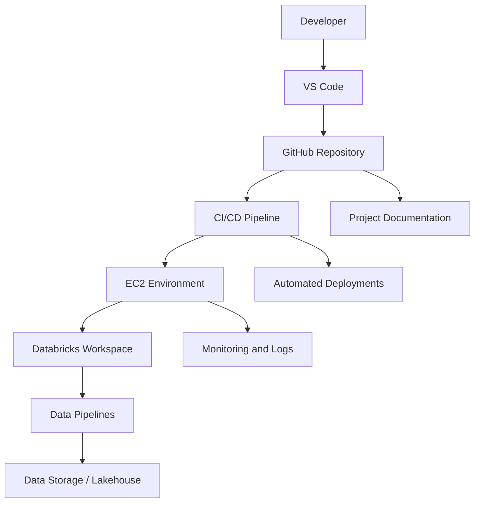

# Project Name

Data Engineering DevOps Stack

# Summary

This project is a lightweight data engineering and DevOps setup designed to demonstrate a modern workflow using VS Code, GitHub, EC2, Databricks, and CI/CD automation. The goal is to build a repeatable environment for data pipelines, infrastructure automation, and deployment practices while keeping the stack simple, scalable, and easy to manage.

# Description

The repository acts as a central project tracker and implementation reference for the data engineering and DevOps workflow. It combines local development in VS Code with remote deployment and integration patterns that include cloud compute, source control, and data platform tooling. The project focuses on practical engineering activities such as environment setup, source versioning, automated delivery, pipeline orchestration, and operational learning.

The technical direction includes:

- Local development and project tracking in VS Code
- GitHub-based source control and collaboration
- EC2 as the compute environment
- Databricks for data processing, notebooks, and asset bundles
- CI/CD pipelines for deployment automation
- Documentation and operational visibility through project tracking

# Tools / Technologies

- VS Code
- Git and GitHub
- Amazon EC2
- Databricks
- Python
- Bash / Shell scripting
- YAML for CI/CD configuration
- Markdown for documentation
- Infrastructure as code concepts
- GitHub Actions or similar automation tooling

# Phase Tracker

| Phase | Name | Status | Owner | Notes |
| --- | --- | --- | --- | --- |
| 1 | Foundation and repo setup | Completed | Project Team | Repository initialized and project structure established |
| 2 | Environment provisioning | In Progress | DevOps Engineer | EC2 and supporting environment setup |
| 3 | GitHub integration | Planned | Engineering Team | Repository sync and access validation |
| 4 | Databricks integration | Planned | Data Engineer | Asset bundle and workflow connection |
| 5 | CI/CD pipeline setup | Planned | DevOps Engineer | Automated validation and deployment |
| 6 | Testing and validation | Planned | QA / Engineering | End-to-end verification |
| 7 | Production readiness | Planned | Project Team | Final hardening and handoff |

# Phase 1 Issues

## Issue 1: Repo and environment were not fully structured at the start

The project lacked a clear initial structure for tracking work, architecture decisions, and implementation status. This created confusion around what needed to be built first and how the stack would evolve.

## Issue 2: Lack of documented architecture and workflow clarity

Without a clear repository map, it was difficult to understand how local development, cloud compute, GitHub, and Databricks connected to each other.

## Issue 3: Minimal implementation documentation

Project goals, environment setup steps, and integration expectations were not fully documented, which slowed onboarding and issue resolution.

# Root Causes

- Incomplete project scaffolding during the first setup phase
- Missing end-to-end architecture view for the stack
- No central tracker for status, blockers, and root-cause analysis
- Limited operational documentation for environment and deployment dependencies
- Insufficient early validation of the GitHub, EC2, and Databricks integration path

# Fixes

- Created a project-level tracker to capture summary, goals, and progress
- Documented architecture and stack relationships in a single source of truth
- Defined a phased project plan with statuses and milestone ownership
- Listed phase issues, root causes, and corrective actions for clarity
- Structured the repository so future implementation tasks can be added in a consistent format
- Identified Databricks and CI/CD integration as the next priority milestones

# Completed Steps

- Project repository established
- Initial project summary created
- Core stack direction identified: VS Code + EC2 + GitHub + Databricks + CI/CD
- Documentation scaffold created for ongoing project tracking
- Phase tracker defined for planning and execution
- Initial issue and root-cause analysis documented

# Key Learnings

- Clear project documentation reduces confusion and speeds up setup
- A phase-based approach helps break down large platform work into manageable milestones
- Version control and environment consistency are critical before automation is introduced
- Databricks integration should be planned early because it impacts pipeline design and deployment choices
- CI/CD works best when the repository, environment, and operational standards are already understood

# Interview Questions

1. What is the business or technical goal of this data engineering stack?
2. Which workloads will run in EC2 versus Databricks?
3. How will code, configuration, and infrastructure be versioned and reviewed?
4. What deployment strategy is expected for CI/CD?
5. Which team owns data platform operations versus application deployment?
6. What kind of monitoring, logging, and alerting is required?
7. How will this environment scale if more data pipelines are introduced?
8. What is the expected onboarding flow for new developers?
9. Which security controls are required for cloud and data workloads?
10. What success metrics will determine whether the architecture is working effectively?

# Architecture Diagram

# Final Note

This tracker should be updated as the project advances through each engineering phase. It is intended to provide stakeholders with a clear record of progress, issues, remediation steps, and technical direction.
