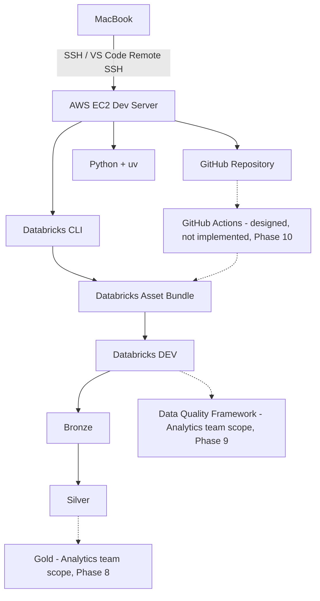
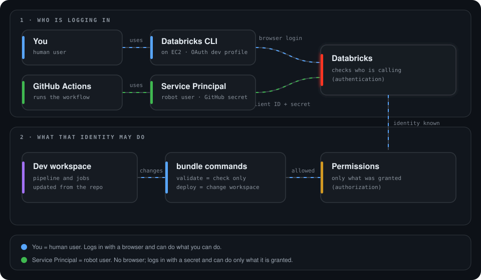

# data-engineering-devops-stack

## Project name

data-engineering-devops-stack

## Project summary

This project is a hands-on data engineering and DevOps workflow built around a remote EC2 development environment, GitHub-based version control, Databricks integration, and CI/CD automation. The goal is to create a practical, repeatable setup for building and deploying data workflows while documenting the engineering decisions, issues, fixes, and lessons learned along the way.

## Architecture

    

Live BTC-USD ticker events flow from Coinbase to an EC2 consumer, are batched into S3, and are loaded incrementally by Databricks Auto Loader into Bronze and Silver Delta tables. A scheduled job runs the pipeline, a health check watches the consumer, and a Databricks Asset Bundle deploys everything as code. The numbered badges match the rows in [Connections, live flow and rules](#connections-live-flow-and-rules).

### Built for startup scale

This design targets **startup scale**: one stream, modest volume and a small team.

| Advantages | Trade-offs |
| --- | --- |
| Low cost: one small server, S3 and a serverless pipeline | One consumer is a single point of failure |
| Simple to run, debug and explain | One connection caps throughput, and scaling is manual |
| Secure by design and deployed as code, with retries and alerts | Not for high volume or many sources. At that scale use Kinesis and Firehose (see [Scale-up path](#scale-up-path)) |

### Data flow by layer

| Layer | What I built |
| --- | --- |
| **Ingestion** | Python WebSocket consumer on AWS EC2, run as a `systemd` service. It buffers events, writes one JSON batch per flush to S3 with `boto3` using an IAM role (no stored access keys), reconnects with backoff, retries uploads and spools to disk if S3 is unavailable. |
| **Governed access** | Unity Catalog Storage Credential and External Location give Databricks controlled access to the raw S3 data. |
| **Bronze** | Auto Loader (`cloudFiles`) in a serverless Lakeflow pipeline appends raw events to a Delta table, adding the source file and ingestion timestamp. |
| **Silver** | Parses the nested JSON, flattens it to one row per price update, casts to `DECIMAL` and `TIMESTAMP`, enforces four data-quality expectations and removes duplicates. |
| **Operations** | A Databricks job runs the pipeline every 15 minutes with retries and failure email. A separate health-check job alerts if the consumer stops writing to S3. |
| **Delivery** | The pipeline, jobs and schedules are defined in a Databricks Asset Bundle (`dev` target) and deployed from the command line. |

### Connections, live flow and rules

    

Every hop is a deliberate connection with its own protocol, access rule and cadence.

- **Least privilege, split by direction.** The EC2 instance can write only under the raw prefix through an IAM role with temporary credentials. Databricks reads that prefix through a separate read-only role. Neither side holds the other's permissions, and no access keys are stored in code.
- **Governed, not open.** Databricks reaches S3 only through a Unity Catalog Storage Credential and External Location, so access is controlled and auditable in one place.
- **Failure rules at every step.** Reconnect and ping on the socket, retries and a disk spool on upload, a checkpoint and quality rules in the pipeline, and retries plus email alerts on the jobs.

### How the streaming buffer works

    

1. **Receive.** The WebSocket client gets a JSON message for every BTC-USD ticker update and keeps the ticker events.
2. **Buffer.** Events collect in a Python list in memory. The list is capped at 50,000 events, and the oldest are dropped if it ever fills.
3. **Flush.** When a message arrives and at least 15 seconds have passed since the last flush, the buffer is written out as **one JSON-lines file** and emptied. The check runs on each message, so there is no separate timer thread.
4. **Upload.** `boto3` puts the file in S3 under `coinbase/raw/YYYY/MM/DD/HH/`, using the EC2 IAM role, with up to 5 attempts and a growing wait between them.
5. **If S3 is unreachable,** the file is saved to a local spool folder so the buffer cannot grow forever. Spooled files are uploaded after the next successful flush and again at startup.
6. **Stay alive.** A dropped connection triggers a reconnect with backoff from 1 to 60 seconds, a ping every 20 seconds detects silent failures, and a stop signal triggers a final flush. systemd restarts the service if it exits.
7. **Hand off.** Each new file is picked up by Auto Loader into Bronze on the next 15-minute job run.

### Scale-up path

    

This build is designed for startup scale. One consumer is a single point of failure, one connection caps throughput, the in-memory buffer is lost if the process is killed without a stop signal, and scaling means managing servers.

| Stage | Architecture | Use it when |
| --- | --- | --- |
| **1. Today** | Source → one EC2 consumer → S3 → Auto Loader → Bronze and Silver | One stream, modest volume, small team |
| **2. Harden** | Same flow, with the consumer in a container on ECS Fargate (image stored in ECR), automatic restarts and CloudWatch alarms | Still one stream, but you want automated deploys and no server to look after |
| **3. Large scale** | Producers → **Kinesis Data Streams** → **Amazon Data Firehose** → S3 → Auto Loader → Bronze, Silver, Gold | High volume, many sources, replay and availability requirements |

**Why Kinesis and Firehose at scale.** Kinesis Data Streams scales with shards, keeps data for replay and lets several consumers read the same stream. Firehose takes over what the Python consumer does by hand: buffering by size or time, retrying, optional transformation, and writing partitioned files to S3. The Databricks side stays almost the same. For seconds-level latency, Databricks can read from Kinesis directly instead of waiting for files.

**What to keep.** Raw Bronze, Silver deduplication on a key (streams deliver at least once), data-quality expectations, Asset Bundle deployment and the freshness alert.

**When to move up.** Move off the single consumer when it can no longer keep up, when more sources or consumers appear, or when you need guaranteed replay or higher availability. For one ticker, Kinesis would add cost and moving parts without a benefit. Check current AWS limits and pricing before sizing.

### Development workflow

Solid lines are built. Dashed lines are outside this project's Data Engineering scope, or designed but not implemented.

### How GitHub Actions would log in (designed, not implemented)

    

- **You = human user.** You log in to Databricks with a browser (OAuth), and you can do what your account is allowed to do.
- **Service Principal = robot user.** GitHub Actions cannot open a browser, so it logs in as a service principal with a client ID and secret kept in GitHub secrets.
- **Same checks, different identity.** Databricks first confirms who is calling (authentication), then allows only the permissions granted to that identity (authorization). The robot is given only what `bundle validate` and `bundle deploy` need.

This flow is a design. No GitHub Actions workflow exists: the account-level federation capability needed for OIDC login was not available in the Databricks Free Edition environment used for this project. See [11-cicd-interview-preparation.md](11-cicd-interview-preparation.md).

Each phase has its own write-up with commands, issues, root causes and fixes; see [Phase files](#phase-files). The ingestion-to-Silver build, the job and the consumer are in [05-databricks-asset-bundle.md](05-databricks-asset-bundle.md).

## Tools / technologies

- VS Code
- AWS EC2
- Ubuntu Linux
- SSH and SSH keys
- Git and GitHub
- Python
- uv
- Databricks CLI
- Databricks Asset Bundle
- GitHub Actions (designed, not implemented; see Phase 10)
- Markdown documentation

## Overall phase tracker

| Phase | Title | Status |
| --- | --- | --- |
| 1 | EC2 + SSH Remote Development Setup | ✅ Completed |
| 2 | Python + uv Environment | ✅ Completed |
| 3 | Git + GitHub Workflow | ✅ Completed |
| 4 | Databricks CLI Authentication | ✅ Completed |
| 5 | Databricks Asset Bundle | ✅ Completed |
| 6 | Development Deployment | ✅ Completed |
| 7 | Approval-Based Deployment | ✅ Completed |
| 8 | Gold Transformations | ↪️ Data Analyst / Analytics team scope |
| 9 | Data Quality Framework | ↪️ Data Analyst / Analytics team scope for this project |
| 10 | GitHub Actions CI/CD | ⚠️ Architecture documented; OIDC deployment blocked by Databricks Free Edition account-level limitation |

**Data Engineering scope: complete.** Ingestion, S3 landing, governed Databricks access, Bronze and Silver, scheduled jobs with alerts, deployment as code, and branch governance are built and running. Gold and the broader data quality framework are Data Analyst / Analytics team scope. GitHub Actions CI/CD is documented as a design, with the OIDC deployment blocked by a Databricks Free Edition limitation.

## Phase files

- [01-ec2-ssh-remote-development.md](01-ec2-ssh-remote-development.md)
- [02-python-uv-environment.md](02-python-uv-environment.md)
- [03-git-github-workflow.md](03-git-github-workflow.md)
- [04-databricks-cli-authentication.md](04-databricks-cli-authentication.md)
- [05-databricks-asset-bundle.md](05-databricks-asset-bundle.md)
- [06-dev-deployment.md](06-dev-deployment.md)
- [07-approval-based-deployment.md](07-approval-based-deployment.md)
- [08-gold-transformations.md](08-gold-transformations.md)
- [09-data-quality-framework.md](09-data-quality-framework.md)
- [10-github-actions-cicd.md](10-github-actions-cicd.md)
- [11-cicd-interview-preparation.md](11-cicd-interview-preparation.md)
