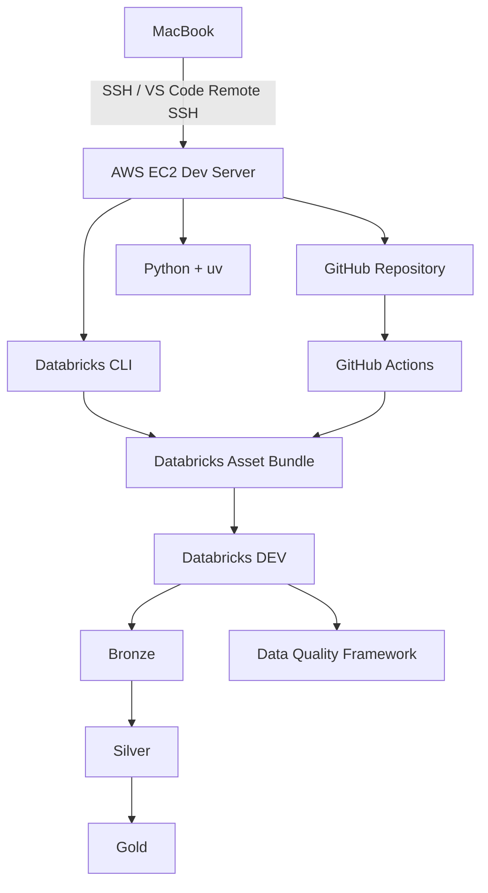

# data-engineering-devops-stack

## Project name

data-engineering-devops-stack

## Project summary

This project is a hands-on data engineering and DevOps workflow built around a remote EC2 development environment, GitHub-based version control, Databricks integration, and CI/CD automation. The goal is to create a practical, repeatable setup for building and deploying data workflows while documenting the engineering decisions, issues, fixes, and lessons learned along the way.

## Architecture

## Tools / technologies

- VS Code
- AWS EC2
- Ubuntu Linux
- SSH and SSH keys
- Git and GitHub
- Python
- uv
- Databricks CLI
- Databricks Asset Bundle
- GitHub Actions
- Markdown documentation
- CI/CD deployment workflow

## Overall phase tracker

| Phase | Title | Status |
| --- | --- | --- |
| 1 | EC2 + SSH Remote Development Setup | ✅ Completed |
| 2 | Python + uv Environment | ✅ Completed |
| 3 | Git + GitHub Workflow | ⏳ Pending |
| 4 | Databricks CLI Authentication | ✅ Completed |
| 5 | Databricks Asset Bundle | ⏳ Pending |
| 6 | Development Deployment | ⏳ Pending |
| 7 | Bronze / Silver / Gold Pipeline | ⏳ Pending |
| 8 | Data Quality Framework | ⏳ Pending |
| 9 | GitHub Actions CI/CD | ⏳ Pending |
| 10 | Approval-Based Deployment | ⏳ Pending |

## Phase files

- [01-ec2-ssh-remote-development.md](01-ec2-ssh-remote-development.md)
- [02-python-uv-environment.md](02-python-uv-environment.md)
- [03-git-github-workflow.md](03-git-github-workflow.md)
- [04-databricks-cli-authentication.md](04-databricks-cli-authentication.md)
- [05-databricks-asset-bundle.md](05-databricks-asset-bundle.md)
- [06-dev-deployment.md](06-dev-deployment.md)
- [07-bronze-silver-gold-pipeline.md](07-bronze-silver-gold-pipeline.md)
- [08-data-quality-framework.md](08-data-quality-framework.md)
- [09-github-actions-cicd.md](09-github-actions-cicd.md)
- [10-approval-based-deployment.md](10-approval-based-deployment.md)
